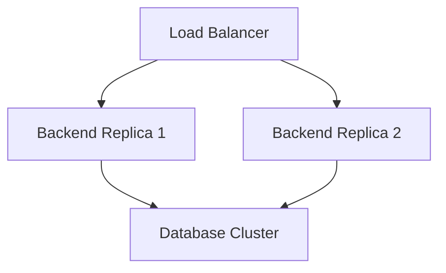

# 🚀 Optimization and Scaling

This document outlines current limitations and strategies to improve performance and scale the system.

## 🚧 Current Limitations

1.  **Single-Node Architecture**: All services run on a single machine via Docker Compose. Performance is limited by the host's CPU and RAM.
2.  **Docker I/O Overhead**: Running databases in containers introduces slight I/O latency compared to bare metal, especially for I/O-heavy workloads like seeding 10M rows.
3.  **DuckDB Execution**: We use `docker exec` to run DuckDB queries. This spawns a new process for every query, adding significant overhead (~100-200ms per query) compared to a persistent connection.

## ⚡ Performance Optimizations

### 1. Optimize DuckDB Integration
**Problem**: `docker exec` is slow.
**Solution**:
*   **Embed DuckDB**: Use the `duckdb` Node.js client directly in the NestJS backend instead of calling the CLI.
*   **Persistent Connection**: Keep a single DuckDB instance open and reuse it.

### 2. ClickHouse Tuning
**Problem**: Default settings are generic.
**Solution**:
*   **Memory Settings**: Increase `max_memory_usage` in `users.xml`.
*   **Data Skipping Indices**: Add indices to the Postgres table engine if supported, or replicate data into native ClickHouse `MergeTree` tables for maximum speed.

### 3. Frontend Rendering
**Problem**: Rendering large datasets (e.g., thousands of points) can lag.
**Solution**:
*   **Virtualization**: Use libraries like `react-window` to render only visible rows in tables.
*   **Data Sampling**: For charts, aggregate data on the backend before sending it to the frontend.

## 📈 Scalability Strategies

### 1. Horizontal Scaling (Backend)
The NestJS backend is stateless. We can scale it by running multiple replicas behind a load balancer (e.g., Nginx or Traefik).

### 2. Database Sharding
If data grows beyond 100M+ rows:
*   **ClickHouse**: Native support for sharding and replication. We can deploy a ClickHouse cluster.
*   **Postgres**: Implement partitioning (e.g., by date) or use Citus for distributed Postgres.

## 🔒 Security Improvements

*   **Secrets Management**: Currently, passwords are in `docker-compose.yml`. Move them to `.env` files and use Docker Secrets.
*   **Network Isolation**: Ensure the `analytics-network` is not exposed to the public internet. Only the Frontend port (via Nginx) should be accessible.

## 🛠 CI/CD Improvements

*   **Automated Testing**: Add GitHub Actions to run `npm run test` and `npm run test:e2e` on every push.
*   **Docker Build Cache**: Configure CI to use Docker layer caching to speed up builds.
