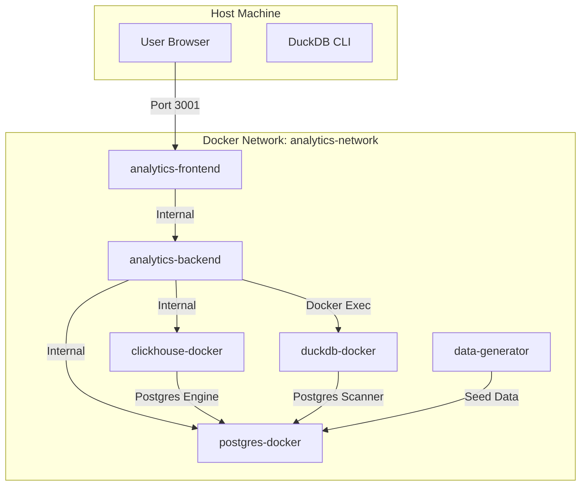

# Docker Environment Overview

This document provides a detailed explanation of how Docker is used in this project to orchestrate the analytics benchmarking environment.

## Architecture Overview

The project uses **Docker Compose** to manage a multi-container application that simulates a real-world analytics stack. The setup includes database engines, a backend API, a frontend UI, and a data generator.



## Services Breakdown

### 1. Database Engines

#### **PostgreSQL (`postgres-docker`)**
- **Image**: `postgres:15-alpine`
- **Role**: The primary source of truth for data. It holds the raw data that other engines query or replicate.
- **Ports**: Exposed on host port `5433` (internal `5432`).
- **Persistence**: Data is persisted in the `postgres_docker_data` volume.
- **Initialization**: Scripts in `./init-scripts` are executed on first startup to create schemas.

#### **ClickHouse (`clickhouse-docker`)**
- **Image**: `clickhouse/clickhouse-server:latest`
- **Role**: High-performance OLAP database.
- **Ports**: HTTP `8123`, Native `9000`.
- **Integration**: Configured to query PostgreSQL data directly using the PostgreSQL Table Engine, allowing for real-time analytics on operational data.

#### **DuckDB (`duckdb-docker`)**
- **Image**: `duckdb/duckdb:latest`
- **Role**: In-process SQL OLAP database.
- **Operation**: Unlike standard services, this container runs a TTY to stay alive. The backend executes queries against it using `docker exec`.
- **Integration**: Uses the `postgres_scanner` extension to read data directly from the Postgres container.

### 2. Application Services

#### **Backend (`analytics-backend`)**
- **Build Context**: `./analytics-benchmark`
- **Role**: NestJS API that orchestrates benchmarks and serves data to the frontend.
- **Dependencies**: Waits for all database services to be healthy before starting.
- **Docker Socket**: Mounts `/var/run/docker.sock` to allow it to execute commands in the DuckDB container.

#### **Frontend (`analytics-frontend`)**
- **Build Context**: `./analytics-frontend`
- **Role**: React-based UI for visualizing benchmark results.
- **Ports**: Exposed on host port `3001`.
- **Nginx**: Uses Nginx to serve static assets and proxy API requests to the backend.

#### **Data Generator (`data-generator`)**
- **Build Context**: `./data-generator`
- **Role**: Python script that seeds the PostgreSQL database with 10 million rows of test data.
- **Lifecycle**: Runs once (`restart: "no"`) and exits after seeding is complete.

## Networking

All services reside in a custom bridge network named `analytics-network`.
- **Internal DNS**: Services communicate using their container names (e.g., `postgres-docker`) as hostnames.
- **Isolation**: The network isolates these containers from other Docker containers on the host system.

## Volumes

- **`postgres_docker_data`**: Persists PostgreSQL data so that the database doesn't reset when containers are restarted.
- **`clickhouse_docker_data`**: Persists ClickHouse data and metadata.

## Key Commands

- **Start Environment**:
  ```bash
  docker-compose up -d
  ```
- **Stop Environment**:
  ```bash
  docker-compose down
  ```
- **View Logs**:
  ```bash
  docker-compose logs -f [service_name]
  ```
- **Rebuild Services**:
  ```bash
  docker-compose up -d --build
  ```
