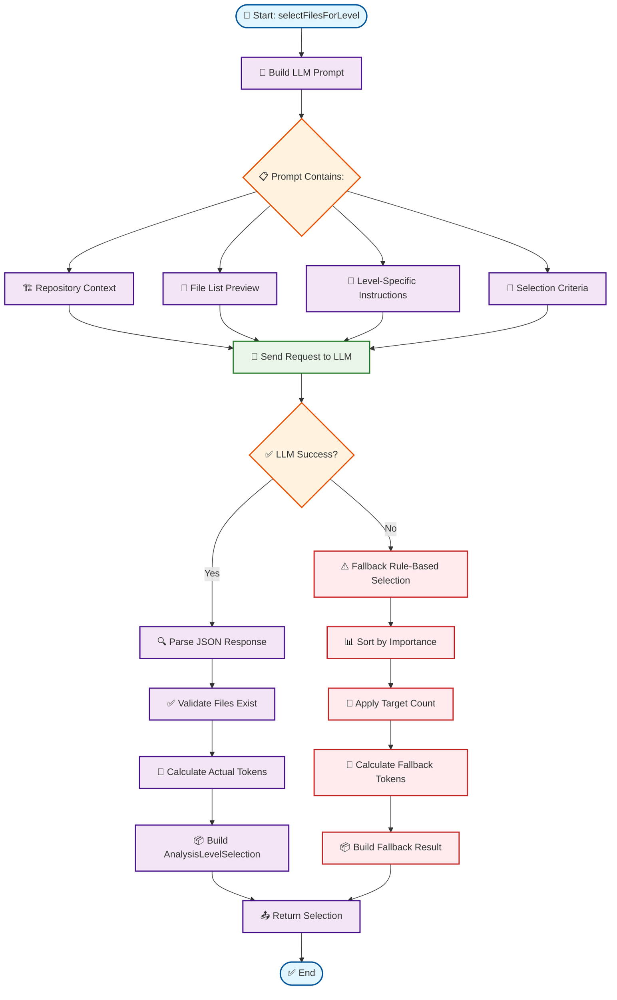
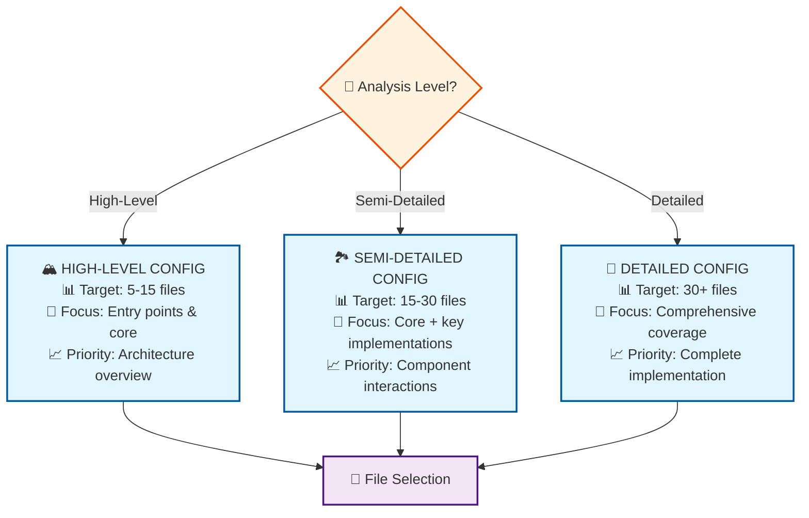
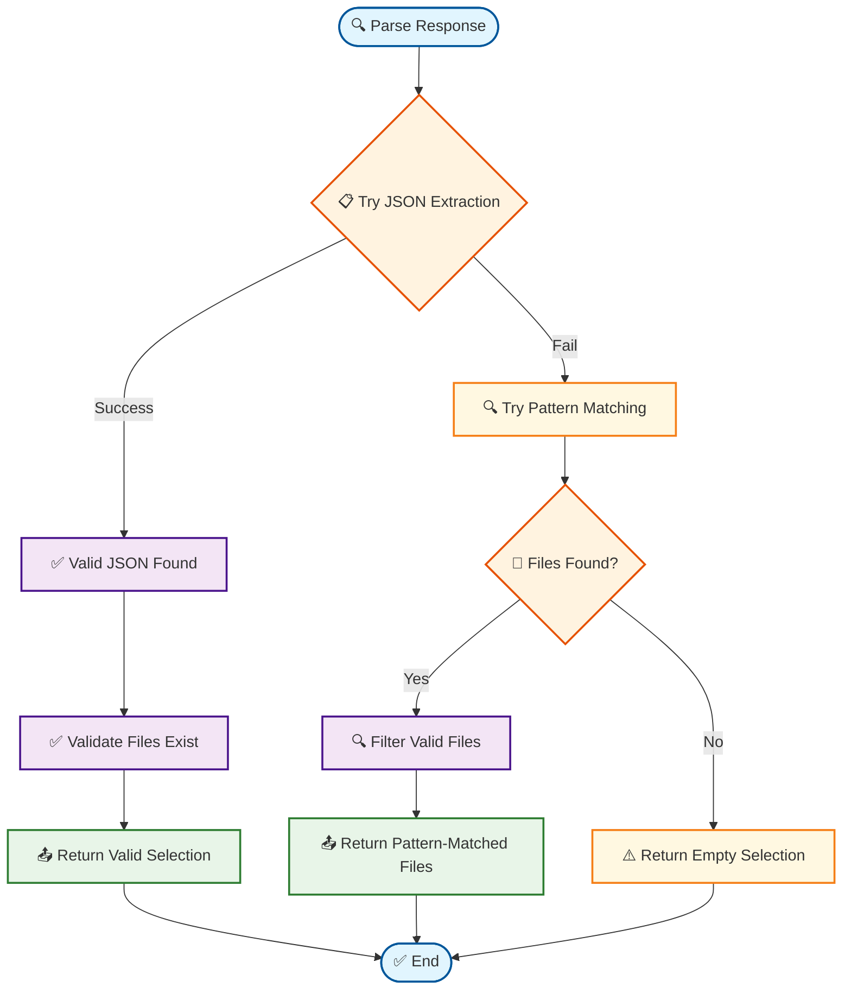

# 🔍 LLM-Guided File Selector Flowchart

## Overview
This flowchart shows how Swark 4.0's intelligent file selection system works using LLM guidance to optimize architecture analysis.

---

## 📊 Main Workflow: `selectFilesForAllLevels()`

```mermaid
flowchart TD
    Start([🚀 Start: selectFilesForAllLevels]) --> Input[📥 Input: Swark4Metadata]
    
    Input --> InitArray[🗃️ Initialize selections array]
    
    InitArray --> HighLevel[🔍 Select High-Level Files]
    HighLevel --> SemiDetailed[🔍 Select Semi-Detailed Files] 
    SemiDetailed --> Detailed[🔍 Select Detailed Files]
    
    Detailed --> Return[📤 Return: AnalysisLevelSelection[]]
    Return --> End([✅ End])

    %% Styling
    classDef startEnd fill:#e1f5fe,stroke:#01579b,stroke-width:2px
    classDef process fill:#f3e5f5,stroke:#4a148c,stroke-width:2px
    classDef decision fill:#fff3e0,stroke:#e65100,stroke-width:2px
    
    class Start,End startEnd
    class Input,InitArray,HighLevel,SemiDetailed,Detailed,Return process
```

---

## 🎯 Individual Level Selection: `selectFilesForLevel()`



---

## 🏗️ Prompt Building Process: `buildFileSelectionPrompt()`


---

## 📊 Analysis Level Targeting



---

## 🔄 Response Parsing Flow: `parseFileSelectionResponse()`



---

## ⚠️ Fallback Selection Strategy: `fallbackFileSelection()`

```mermaid
flowchart TD
    StartFallback([⚠️ Fallback Selection]) --> SortImportance[📊 Sort by Importance]
    
    SortImportance --> ImportanceOrder[📋 Importance Order:<br/>1️⃣ Entry-point (4)<br/>2️⃣ Core (3)<br/>3️⃣ Utility (2)<br/>4️⃣ Dependency (1)]
    
    ImportanceOrder --> LevelCheck{🎯 Target Level?}
    
    LevelCheck -->|High-Level| HighFallback[🏔️ Select Entry-point + Core<br/>Target: 10 files]
    LevelCheck -->|Semi-Detailed| SemiFallback[🏞️ Select Non-dependency<br/>Target: 25 files]
    LevelCheck -->|Detailed| DetailedFallback[🔬 Select Non-dependency<br/>Target: 50 files]
    
    HighFallback --> CalcFallbackTokens[🧮 Calculate Tokens]
    SemiFallback --> CalcFallbackTokens
    DetailedFallback --> CalcFallbackTokens
    
    CalcFallbackTokens --> BuildFallbackResult[📦 Build Result with Reasoning]
    BuildFallbackResult --> EndFallback([✅ Fallback Complete])

    %% Styling
    classDef startEnd fill:#e1f5fe,stroke:#01579b,stroke-width:2px
    classDef process fill:#f3e5f5,stroke:#4a148c,stroke-width:2px
    classDef decision fill:#fff3e0,stroke:#e65100,stroke-width:2px
    classDef fallback fill:#ffebee,stroke:#c62828,stroke-width:2px
    classDef info fill:#e8f5e8,stroke:#2e7d32,stroke-width:2px
    
    class StartFallback,EndFallback startEnd
    class SortImportance,CalcFallbackTokens,BuildFallbackResult process
    class LevelCheck decision
    class HighFallback,SemiFallback,DetailedFallback fallback
    class ImportanceOrder info
```

---

## 🎯 Key Features & Benefits

### 🤖 **LLM-Guided Intelligence**
- Uses AI to understand repository context and select optimal files
- Provides reasoning for file selection decisions
- Adapts to different project types and structures

### 📊 **Multi-Level Analysis**
- **High-Level**: Architectural overview with core components
- **Semi-Detailed**: Balanced view with key implementations  
- **Detailed**: Comprehensive coverage for deep analysis

### ⚡ **Robust Fallback System**
- Rule-based selection when LLM fails
- Importance-based file ranking
- Ensures analysis always completes successfully

### 🧮 **Token Optimization**
- Calculates actual token usage for selections
- Prevents context window overflow
- Provides efficiency metrics for analysis

### 🔍 **Smart Parsing**
- JSON response parsing with validation
- Pattern matching fallback for file extraction
- Robust error handling throughout the process

---

## 📈 **Performance Characteristics**

| Aspect | High-Level | Semi-Detailed | Detailed |
|--------|------------|---------------|----------|
| **File Count** | 5-15 files | 15-30 files | 30+ files |
| **Focus Area** | Architecture | Components | Implementation |
| **Token Usage** | Minimal | Moderate | Comprehensive |
| **Analysis Depth** | Overview | Balanced | Complete |

---

*This flowchart represents the sophisticated LLM-guided file selection system in Swark 4.0, designed to intelligently analyze repositories at multiple levels of detail while optimizing for token efficiency and analytical value.*
