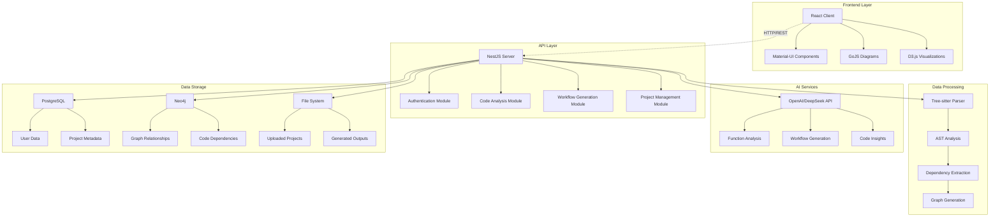
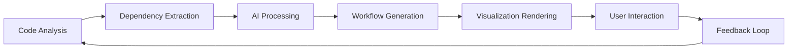

# 🧠 MindMap - Advanced Code Analysis & Workflow Visualization Platform


## 📋 Project Overview

MindMap is a sophisticated code analysis and workflow visualization platform that transforms complex codebases into interactive, hierarchical mindmaps and dynamic workflow diagrams. It leverages AI-powered analysis to provide deep insights into code structure, dependencies, and execution flows.

## 🌟 Key Features

### 🔍 **Intelligent Code Analysis**
- **Multi-language Support**: TypeScript, JavaScript, Python, Java, C++
- **AST-based Parsing**: Uses Tree-sitter for accurate syntax analysis
- **Dependency Graph Generation**: Maps function calls, imports, and relationships
- **Complexity Analysis**: Calculates cyclomatic complexity and code metrics

### 🎨 **Interactive Visualizations**
- **Hierarchical MindMaps**: Multi-level expandable node structures
- **Dynamic Workflow Diagrams**: GoJS-powered execution flow visualization
- **Force-directed Graphs**: D3.js network visualization
- **Real-time Interaction**: Click, expand, collapse, and navigate seamlessly

### 🤖 **AI-Powered Features**
- **Function Extraction**: Precise line-range based code extraction
- **Workflow Generation**: LLM-powered execution flow creation
- **Dependency Analysis**: Recursive dependency tree traversal
- **Smart Recommendations**: Context-aware code insights


## 🏗️ System Architecture



## 🚀 Getting Started

### Prerequisites

- **Node.js** 18+ 
- **npm** or **yarn**
- **PostgreSQL** 12+
- **Neo4j** 4.0+ (optional)
- **Git**

### Installation

1. **Clone the Repository**
   ```bash
   git clone https://github.com/ncompass-ts/mindmap.git
   cd mindmap
   ```

2. **Install Dependencies**
   ```bash
   # Install root dependencies
   npm install
   
   # Install client dependencies
   cd client
   npm install
   
   # Install server dependencies
   cd ../server
   npm install
   ```

3. **Environment Configuration**

   Create `.env` files in both client and server directories:

   **Server `.env`:**
   ```env
   # Database Configuration
   DB_HOST=localhost
   DB_PORT=5432
   DB_USERNAME=your_username
   DB_PASSWORD=your_password
   DB_NAME=mindmap_db
   
   # Neo4j Configuration (Optional)
   NEO4J_URI=bolt://localhost:7687
   NEO4J_USERNAME=neo4j
   NEO4J_PASSWORD=your_neo4j_password
   
   # AI Services
   OPENAI_API_KEY=your_openai_api_key
   
   # JWT Configuration
   JWT_SECRET=your_jwt_secret
   JWT_EXPIRES_IN=24h
   
   # File Storage
   USERS_ROOT=./users
   ```

   **Client `.env`:**
   ```env
   VITE_API_BASE_URL=http://localhost:3000
   VITE_APP_NAME=MindMap
   ```

4. **Database Setup**
   ```bash
   # Create PostgreSQL database
   createdb mindmap_db
   
   # Run migrations (if available)
   cd server
   npm run migration:run
   ```

5. **Start Development Servers**

   **Terminal 1 - Backend:**
   ```bash
   cd server
   npm run start:dev
   ```

   **Terminal 2 - Frontend:**
   ```bash
   cd client
   npm run dev
   ```

   🌐 **Access the application:**
   - Frontend: http://localhost:5173
   - Backend API: http://localhost:3000

## 📁 Project Structure

```
mindmap/
├── client/                          # React Frontend Application
│   ├── src/
│   │   ├── components/             # Reusable React Components
│   │   │   ├── Atoms/             # Basic UI components
│   │   │   ├── GenerateMindmap/   # MindMap generation components
│   │   │   ├── Mindmap/           # Interactive mindmap components
│   │   │   ├── Pages/             # Page-level components
│   │   │   └── Steps/             # Multi-step workflows
│   │   ├── config/                # Configuration files
│   │   ├── data/                  # Static data and graph definitions
│   │   ├── hooks/                 # Custom React hooks
│   │   └── services/              # API service functions
│   ├── public/                    # Static assets
│   └── package.json
│
├── server/                         # NestJS Backend Application
│   ├── src/
│   │   ├── auth/                  # Authentication module
│   │   ├── code-analyzer/         # Code analysis services
│   │   ├── entities/              # Database entities (TypeORM)
│   │   ├── generate-service/      # Workflow generation module
│   │   ├── neo4j/                 # Neo4j integration
│   │   ├── preprocess/            # File preprocessing services
│   │   ├── projects/              # Project management module
│   │   ├── repo/                  # Repository handling
│   │   ├── user/                  # User management
│   │   └── utils/                 # Utility functions
│   └── package.json
│
├── users/                          # User project storage
├── shared.ts                       # Shared type definitions
└── README.md
```

## 🔧 Core Features Deep Dive

### 1. **Code Analysis Engine**

**Technologies**: Tree-sitter, TypeScript AST, Multi-language parsers

The code analysis engine is the heart of MindMap, providing:

- **Syntax Tree Parsing**: Accurate AST generation for multiple languages
- **Function Extraction**: Precise identification of functions, classes, and methods
- **Dependency Mapping**: Tracks imports, calls, and references
- **Complexity Metrics**: Cyclomatic complexity and code quality indicators

```typescript
// Example: Function dependency extraction
const analysisResult = {
  functions: [
    {
      id: "src/auth/auth.service.ts#validateUser",
      name: "validateUser",
      startLine: 15,
      endLine: 28,
      complexity: 5,
      dependencies: ["bcrypt.compare", "userService.findById"]
    }
  ]
}
```

### 2. **AI-Powered Workflow Generation**

**Technologies**: OpenAI/DeepSeek API, Custom prompting, JSON schema validation

The workflow generation system creates detailed execution flows:

- **Recursive Dependency Analysis**: Follows function calls to arbitrary depth
- **Smart Node Creation**: Minimum node requirements based on function count
- **Context-Aware Generation**: Uses actual code content for accurate workflows
- **Validation & Quality Assurance**: Ensures generated workflows meet requirements

**Workflow Generation Process:**
1. Extract parent function content
2. Recursively analyze child dependencies
3. Generate LLM prompt with code context
4. Create workflow JSON with validation
5. Render interactive GoJS diagram

### 3. **Interactive Visualization Components**

#### **MindMap Component (React + Custom Rendering)**
```typescript
// Hierarchical node structure with expand/collapse
interface MindMapNode {
  id: string;
  name: string;
  children?: MindMapNode[];
  hasChildren: boolean;
  isExpanded: boolean;
  level: number;
  complexity: number;
}
```

#### **Dynamic Workflow Visualization (GoJS)**
```typescript
// Professional workflow diagrams with multiple node types
const nodeTypes = {
  start: "Ellipse with green fill",
  process: "RoundedRectangle with blue fill", 
  decision: "Diamond with orange fill",
  end: "Ellipse with red fill"
}
```

#### **Force Graph Network (D3.js)**
- Real-time force simulation
- Interactive node dragging
- Dynamic link highlighting
- Zoom and pan capabilities

### 4. **Backend Architecture**

#### **Modular NestJS Structure**
- **Auth Module**: JWT-based authentication with GitHub OAuth
- **Code Analyzer**: Multi-language parsing and analysis
- **Generate Service**: AI-powered workflow and diagram generation
- **Project Management**: User project lifecycle management
- **File Processing**: Upload, extraction, and storage handling

#### **Database Design**
```sql
-- Core entities
Users -> Projects -> GeneratedOutputs
Projects -> PreprocessedData
Users -> GithubTokens
Users -> RefreshTokens
```

## 🎯 Use Cases

### 1. **Code Documentation**
- Generate visual documentation for complex codebases
- Create interactive exploration tools for new team members
- Provide architectural overviews for stakeholders

### 2. **Code Review & Analysis**
- Identify complex functions and potential refactoring candidates
- Visualize dependency relationships and coupling
- Track code evolution and architectural changes

### 3. **Educational & Training**
- Teach software architecture concepts
- Demonstrate code execution flows
- Create interactive learning materials

### 4. **Project Planning**
- Understand existing codebase structure before modifications
- Plan refactoring efforts based on dependency analysis
- Estimate impact of proposed changes

## 🔄 Development Workflow

### **Feature Development Process**



### **Key Development Areas**

1. **Parser Enhancement**: Adding support for new programming languages
2. **AI Prompting**: Improving workflow generation accuracy
3. **Visualization**: Creating new diagram types and interactions
4. **Performance**: Optimizing large codebase processing
5. **UI/UX**: Enhancing user experience and accessibility


```bash
# Run tests
npm run test          # Unit tests
npm run test:e2e      # End-to-end tests
npm run test:cov      # Coverage reports
```


## 📚 API Documentation

### **Core Endpoints**

```typescript
// Authentication
POST   /auth/login          # User authentication
POST   /auth/refresh        # Token refresh
GET    /auth/profile        # User profile

// Projects
GET    /projects            # List user projects
POST   /projects            # Create new project
GET    /projects/:id        # Get project details
DELETE /projects/:id        # Delete project

// Code Analysis
POST   /code-analyzer/analyze    # Analyze uploaded code
GET    /code-analyzer/results    # Get analysis results

// Workflow Generation
POST   /flowchart/generateWorkflow   # Generate workflow
GET    /flowchart/generateD2         # Generate D2 diagram
GET    /flowchart/generateMd         # Generate markdown
```

## 🔧 Configuration Options

### **Advanced Settings**

```typescript
// Analysis configuration
interface AnalysisConfig {
  maxDepth: number;           // Dependency traversal depth
  minComplexity: number;      // Minimum complexity threshold  
  languages: string[];        // Supported languages
  excludePatterns: string[];  // File exclusion patterns
}

// Workflow generation settings
interface WorkflowConfig {
  minNodes: number;          // Minimum workflow nodes
  maxNodes: number;          // Maximum workflow nodes
  nodeTypes: string[];       // Allowed node types
  layoutDirection: string;   // Layout orientation
}
```

## 🐛 Troubleshooting

### **Common Issues**

1. **Database Connection Issues**
   ```bash
   # Check PostgreSQL status
   pg_ctl status
   
   # Verify connection
   psql -h localhost -U username -d mindmap_db
   ```

2. **API Key Configuration**
   ```bash
   # Verify environment variables
   echo $OPENAI_API_KEY
   
   # Check server logs
   tail -f server/logs/application.log
   ```


- **Organization**: ncompass-ts


*Transform your code into visual insights with MindMap - where complexity becomes clarity.*